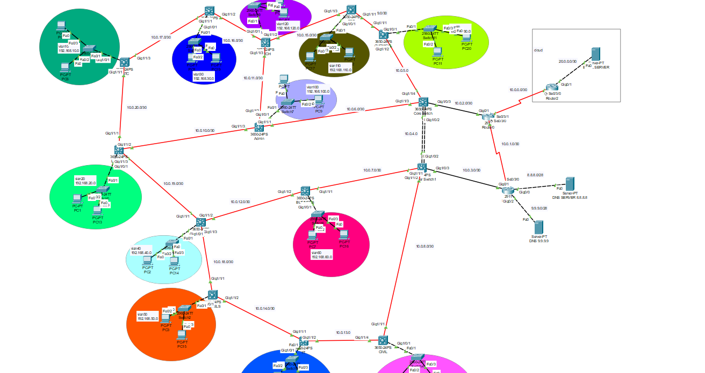
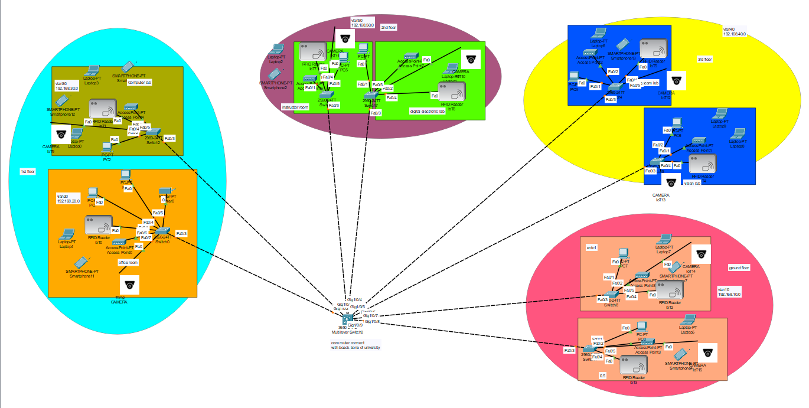

# University & Department Network Design in Cisco Packet Tracer

This project demonstrates the implementation of a robust and scalable network infrastructure for a university campus backbone and a specific department (ENTC), designed and simulated using Cisco Packet Tracer. The design emphasizes connectivity, routing efficiency, and automated IP address management.

---

## Table of Contents

- [Project Overview](#project-overview)
- [Key Features](#key-features)
- [Network Topologies](#network-topologies)
- [Routing Protocol](#routing-protocol)
- [IP Address Management](#ip-address-management)
- [Project Files](#project-files)
- [How to Use](#how-to-use)
- [Visualizations](#visualizations)
- [Future Enhancements](#future-enhancements)
- [Acknowledgements](#acknowledgements)

---

## Project Overview

This Cisco Packet Tracer project showcases the design and implementation of two interconnected networks:

1.  **University Backbone Network (UOM):** A foundational network infrastructure for the entire university, ensuring high availability and connectivity across various faculties and departments.
2.  **ENTC Department Network:** A specialized network designed to meet the specific requirements of the Electronics and Telecommunication Engineering (ENTC) department, integrated seamlessly with the university backbone.

The design prioritizes network resilience, efficient packet delivery, and simplified device configuration.

---

## Key Features

-   **Simulated Environment:** Implemented entirely within Cisco Packet Tracer for easy sharing, simulation, and analysis.
-   **Hybrid Network Topology:** Utilizes a strategic mix of **star and mesh topologies** to enhance fault tolerance and prevent single points of failure, ensuring high availability and robust connection paths.
-   **Dynamic Routing with OSPF:** Employs the **Open Shortest Path First (OSPF)** routing protocol for efficient and dynamic packet routing within and between the networks, allowing for automatic route recalculation in case of link failures.
-   **Automated IP Assignment (DHCP):** Configures **Dynamic Host Configuration Protocol (DHCP)** to automatically assign IP addresses to devices, simplifying network administration and device onboarding.

---

## Network Topologies

The network design strategically combines different topologies:

*   **Backbone Network:** Features a **mesh-like topology** among core routers to provide redundancy and multiple paths, minimizing connection loss.
*   **Department Network:** Utilizes a **star topology** for end-device connectivity to departmental switches, which then connect to the backbone. This provides centralized management and easy scalability within the department.

This hybrid approach ensures both high reliability for critical inter-network communication and manageability for local access.

---

## Routing Protocol

**OSPF (Open Shortest Path First)** is the chosen interior gateway protocol for this project.

*   **Dynamic Path Selection:** OSPF allows routers to dynamically discover the best paths for packet delivery, adapting to changes in the network topology (e.g., link failures or additions).
*   **Load Balancing:** OSPF can facilitate load balancing over equal-cost paths, if configured.
*   **Scalability:** Suitable for large networks like a university campus due to its hierarchical design capabilities (using areas).

---

## IP Address Management

**DHCP (Dynamic Host Configuration Protocol)** is configured on central network devices (e.g., routers or servers) to:

*   Automatically assign unique IP addresses, subnet masks, default gateways, and DNS server information to end devices (PCs, laptops, etc.).
*   Reduce manual configuration errors and administrative overhead.
*   Efficiently manage IP address pools within each network segment.

---

## Project Files

```

Network-Design-Project/
├── Backbone_of_the_University/
│ └── backbone.pkt # Cisco Packet Tracer file for the University Backbone Network
│
├── Department_Network/
│ └── ENTC department.pkt # Cisco Packet Tracer file for the ENTC Department Network
│
├── Images/
│ ├── Backbone.png # Screenshot/Diagram of the University Backbone Network topology
│ └── Department.png # Screenshot/Diagram of the ENTC Department Network topology
│
└── README.md # This documentation file
```

---

## How to Use

To explore and interact with this network design:

1.  **Download Cisco Packet Tracer:** Ensure you have Cisco Packet Tracer installed on your system. You can typically download it from the Cisco Networking Academy website after registering.
2.  **Clone the Repository:** Clone this GitHub repository to your local machine.
3.  **Open .pkt Files:** Navigate to the `Backbone_of_the_University/` and `Department_Network/` directories and open the `.pkt` files using Cisco Packet Tracer.
4.  **Explore and Test:**
    *   Observe the network topologies.
    *   Examine device configurations (routers, switches, PCs).
    *   Test connectivity using `ping` commands between various devices.
    *   Verify OSPF routing tables on routers using `show ip route ospf` and `show ip protocols` commands.
    *   Check DHCP server configurations and client IP assignments.

---

## Visualizations

Here are visual representations of the implemented network topologies:

### University Backbone Network


### ENTC Department Network


---

## Future Enhancements

Potential areas for future development and enhancement include:

*   **VLAN Implementation:** Segmenting the network further using VLANs for enhanced security and broadcast domain control.
*   **Inter-VLAN Routing:** Configuring routing between VLANs on multilayer switches or routers.
*   **Access Control Lists (ACLs):** Implementing security policies to filter traffic.
*   **Wireless Network Integration:** Adding wireless access points and configuring WLANs.
*   **Network Monitoring:** Integrating tools for real-time network performance monitoring.

---

## Acknowledgements

This project was developed as an academic exercise in network design and implementation.
